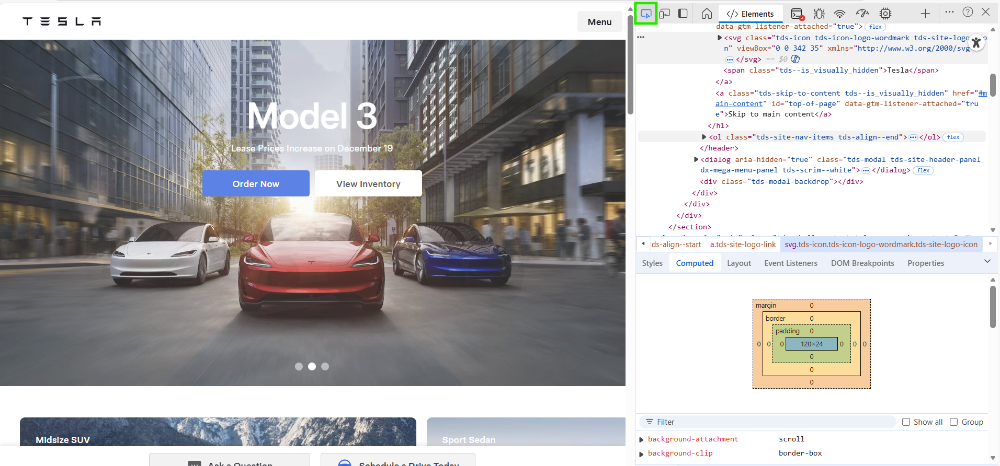

# Tesla-Page-Zaio
Assessment from Zaio - the Tesla page
## Certificate:


## HTML basics
1. Lists: 
We can use the tag `<ol>` for ordered list, and the tag `<ul>` for unordered list. But we actually do not need for this project tesla webpage.
```list_challenge.html
<h1>List Challenge</h1>
<p>This document includes ordered and unordered lists with list items.</p>
<!-- Your code here  -->
<br>
<h2>Top 3 Programming Languages</h2>

<ol>
    <li>Javascript</li>
    <li>Python</li>
    <li>Java</li>
</ol>
<br>
<h2>Benefits of Learning Coding</h2>
<ul>
    <li>Problem Solving</li>
    <li>Career Opportunities</li>
    <li>Creativity</li>
</ul>
```

2. Buttons:
- Buttons are important elements in web development. They are often used inside a `<form>` tag or `<form>` element, along with input fields such as username and password (e.g., in a login form).
- You can create a button in a web page using the `<button>` tag. Buttons are very useful when building interactive websites.
- You can also style your buttons extensively using CSS to match the look and feel of your site.


3. Span tag
- A span tag in inline container used to mark up the part of the text, or a part of the document.
- use the `<span>` tag to make use of the span. It gives you a lot of flexibility - no predefined stuff
- Not necessary, you can actually create your web page without it. but it actually comes in handy when you want to make the part of the text look good.
- The `<span>` tag is easily styled by CSS or manipulated with JavaScript using the class or id attribute.
- The `<span>` tag is much like the `<div>` element, but `<div>` is a block-level element and `<span>` is an inline element.
```span_and_buttons_challenge.html
<h1>Button and Span Challenge</h1>
<!-- Your code here  -->
<button id="button1">Button 1</button>
<button id="button2">Button 2</button>
<button id="button3">Button 3</button>

<span id="output">No button clicked yet</span>
```

4. Commenting the code and Summary:

- use the shortcut cntrl + /. In HTML language `<!--Explain what your code does,  -->`. It's actually helpful in big project to explain your code there.
- Very good practice, helps with code handovers, and debugging. Use for hiding things temporarily as a developer

- `<a>` anchor tag, we require href, where you can include the absolute or relative path,
- relative paths are used to point to the external links
- absolute paths are used to point to the loca 

- `` tags are self closing elements, ``
- similar to the `<a>`, `<a href=""></a>` except that they using the `src` attribute instead of `href`
- `` uses the alt attribute for providing descriptions, has to be present but they can be empty string.

## CSS Basics

1. CSS syntax:

selector:       Declaration             Declaration

```

    h2: {  
            color: Blue;            
            font-size: 10px; 
        }


```

``
            property: value
``

- Target the specific element, give it a properties, background color, text alignment, and many more properties.
- CSS code, inline CSS, internal CSS. You are putting these styles directly in the HTML document, ditrectly style in the document on the specific element, 

### Inline Style
- Are defined in the style attribute of the element,
- May be used to apply a unique style for an single element.
- Inline CSS, you can put the styling directly on the specific element: 

`<h1 style="color: Blue;">This is inline styling</h1> ` -> this is inline.

- Never use the Inline style, it is a very bad practice. NO!!!! You won't be able to reuse your similar styling should your code gets bigger.

### Internal CSS:
- It is defined with the HTML page, inside the `<style>` element - Inside the head section `<head></head>`.
- Internal Style sheet may be used when the one single HTML page has a unique styling.
- Be used in that specific HTML page, in `<head>` section.

```
<style>
    body: {
        color: red;
        font-size: 12px;
    }
</style>
```
- Not recommended as your code gets bigger, you gonna get confused with styling your sections

### External CSS:
- It is recommended to be used, it is linked to the HTML page and all the CSS can be placed in the file.
- Each HTML page must include a reference to the external style sheet file inside the `<link>` element, inside the `<head>` section.

```
<head>
    <link rel="stylesheet" href="style.css">
</head>
```

2. Favicon:

- Company icon - logo, can be added as the favicon to the web page.
- use the link tag to link the favicon for the page,   `<link rel="icon" href="./assets/favicon.png">`

3. Simple selector:

- Used to find or select the HTML element you want to style.
- Types of selectors: Simple selector - select based on name, id, class.
- Name is the tag name, like h1, h2, etc
- Id selector is the id attribute, that you can use to style the specific element - use `#`
- Class selector is the class attribute, that you can re-use to style the multiple elements - use `.`
- 

3. CSS Box Model:

- Elements can be considered as box, hence Box model. 
- Box models: Margins, Boarders, Padding and content
- Content: COntent of the box, eg. text or images,
- Padding: Area around that content,
- Boarder: Boarder around the padding
- Margin: Area outside the boarder, can be added

You can apply changes to the specific element you want, either on padding/Margin/Border, it's up to you.
e.g.

```
h1 {
    color: yellow;
    margin: 10px;
    margin-bottom: 20px;
    border: 20px red solid;
    padding: 50px;
}
```
You can apply these Box models to any element, preferrably span elements
4. CSS Box sizing
- You can include the padding and border in an element's total width and height
- Witout Box-sizing:

 + `Width + Padding + Border == Actual Width of an element`
 + `Height + Padding + Border == Actual Height of an element`

- With Box-sizing: Border-box
 + padding and border are included in the width and height of an element

- Universal selector: gets applied to all your HTML elements
You can use the asterisks to apply the universal selector when applying a box sizing of the element.

```
* {
    margin: 0;
    padding: 0;
    box-sizing: border-box;
}
```

- N.B: Need more explaination on the Box sizing.

- After setting the above universal selector you can set the Width and Height of the element nicely.

```
.box {
    width: 50px;
    height: 50px;
    background-color: red;
}
```

5. Getting the background to work.

- We need to work on the background now that we know the Box models and sizing.
- Know a few shortcuts to use, like:

```
div.banner-wrap
```
This ends up creating for you this:

```
    <div class="banner-wrap">
        
    </div>
```

6. Getting the background to work
- Work on the background to fix some issues.
- you can add image background from your assets directory, set the view height. So that whatever the device you are using it's going to set to the view height of that device, same thing with the view width of that backgound image. e.g.:

```
.banner-wrap {
    background-image: url(./assets/banner.jpg);
    height: 100vh;
}
```

- `vh` and `vw` are CSS units that are often used with background-image (and other properties) to make things responsive: 1vh = 1% of the viewport height (viewport = the visible browser window); 1vw = 1% of the viewport width.
- But with the above it is still not looking great, we need to set up some properties of the background image to look great. 
a. ``background-size: cover;`

This tells the browser:

“Make the background image big enough to cover the entire element.”
Even if part of the image gets cropped.

- It keeps the aspect ratio (does not stretch weirdly).
- It fills the whole area (no empty spaces).
- Good for banners, hero sections, fullscreen background

b. ``background-position: center;``

This property controls the starting point of the background image.

center means:

 “Place the image in the center of the element.”

Useful when using cover, because the center of an image is usually the most important part that should remain visible.

c. ``background-repeat: no-repeat;``

This tells the browser:

 “Do not repeat/tile the background image.”

```
background-size: cover;
background-repeat: no-repeat;
background-position: center;
```

7. Getting The Tesla Logo:

- Let's get the Tesla Logo from the Tesla page.

- The tesla page is using a svg logo. The following is the instructions on how to see the Logo properties, like height and width of the element.
a. Click on the Element, go to options > Inspect > And click on the little screen arrow icon on the Inspect options:


8. Using the FlexBox to cleanup the NavBar: CSS Flexbox
NB: **CSS Flexbox is short for the CSS Flexible Box Layout module. Flexbox is a layout model for arranging items (horizontally or vertically) within a container, in a flexible and responsive way.**

- Flexbox makes it easy to design a flexible and responsive layout, without using float or positioning.


- When using Flexbox, moment you give the element - 'flex' it puts everything in a row

e.g. 

```
.menu-box {
    display: flex;
}

```
- CSS Flexbox Components - A flexbox always consists of:

 + A Flex menu box - The parent (menu-box) element, where the display property is set to flex or inline-flex
 + One or more Flex Items - The direct children of the flex container automatically becomes flex items

- **CSS Flex Container Properties**
**The flex container element can have the following properties:**

 + **display** - Must be set to flex or inline-flex
 + **flex-direction** - Sets the display-direction of flex items
 + **flex-wrap** - Specifies whether the flex items should wrap or not
 + **flex-flow** - Shorthand property for flex-direction and flex-wrap
 + **justify-content** - Aligns the flex items when they do not use all available space on the main-axis (horizontally)
 + **align-items** - Aligns the flex items when they do not use all available space on the cross-axis (vertically)
 + **align-content** - Aligns the flex lines when there is extra space in the cross axis and flex items wrap

- Flexible **flex-direction**: 
 + Defines the direction in which the container wants to stack the flex items.
 + row, column, 
 + Or column-reverse, row-reverse. Nut not the best practices

- Flexbox **justify-content**: Used to align items -:
 + flex-start
 + flex-end
 + center
 + space-around
 + space-between

- Flexbox **align-items**: Used to align items as well, opposite direction
 + flex-start - 'Top'
 + flex-end - 'Bottom'
 + center - 'Center'
 + stretch
 + baseline


8. Cleaning up the Main section with Text-Align, Calc & Flex:

- Lets cleanup our main section, by text align first.
Main Section:
```
<main>
    <div>
    </div>
</main>
```

- A challenge for me:

```
main {
    text-align: center;
}

/* set height for main */
/* flex, column, spacebetween  */
```


- We have set the property values, but we've hardcoded them in this lesson which is not a good practice. We need to use the dynamic property values which has a lesson in the netflix assessments.

- We have used the text alignment, flex and the cal CSS function mainly on the Main section, for title section and action area.

9. Cleaning up fonts:

- You can inspect the page on the `tesla.com` homepage and view what type of fonts are they using.
- Once you verified the fonts, the page to view the fonts family type in the following website `fonts.google.com`, you can import one and reference it in your CSS styling. 
- Most companies they will use their own fonts-famiy type, buy one and use them in their websites.
- Use the import function in the CSS and add the link for that font picked in the fonts.google.com and specify the font-family type in the CSS styling.

10. Nav items with Hover Effect:

- We can actually add spaces to the nav items, of 5px top and bottom, 15px right and left - use padding property.
- We need to add point effect so that whenever the user hover over these nav items shows pointer effect. Make use of the `cursor` property.
- Let's add the `Sudo-type selector` for when the user hover over the nav item, it should show this background color behind the pointed item and then add the radius for this background hover. Set all the borders for this background-hover - top, bottom, right and left to 9999px. Standard value for background hover.
- 

11. Styling the Button and fixinng minor issues:

- add the corresponding padding, margin, width and Height of the buttons from the tesla.com homepage, for the action buttons below the car image.
- Add the similar border effects from the nav items to the buttons. Make sure the buttons' properties like margins are similar to the ones in tesla homepage, the left and right buttons' color and background-color are likewise.

